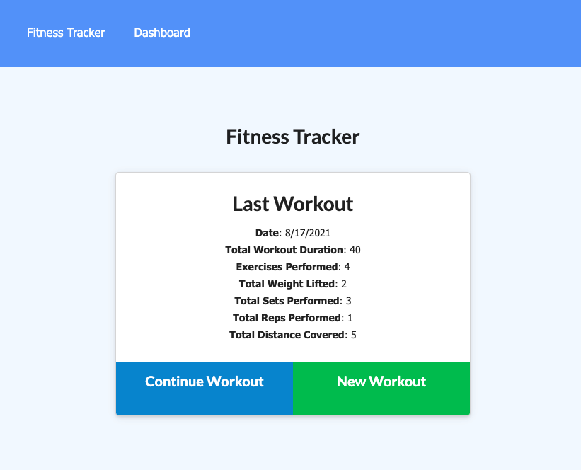

# Workout-Tracker-with-MongoDB


#### full stack application using Javascript ES6, MongoDB, Mongoose, Express, Node.js packages and deployed to Heroku with MongoDB Atlas

## Table of Contents

**[Quick Links](#Quick-Links)**<br>
**[First Looks](#First-Looks)**<br>
**[Wireframes](#Wireframes)**<br>
**[Bugs and Known Issues](#Bugs-and-Known-Issues)**<br>
**[Next Steps to Continue](#Next-Steps-to-Continue)**<br>
**[Acceptance Criteria](#Acceptance-Criteria)**<br>
**[Bonus](#Bonus)**<br>
**[Deliverables](#Deliverables)**<br>
**[License](#License)**<br>

## Quick Links

- click here to view --> [final website](https://fitness-tracker-using-mongodb.herokuapp.com/?id=611c33c53e6a990016dfd102)

- click here to view --> [README GUIDE from UT](https://github.com/the-Coding-Boot-Camp-at-UT/UTA-VIRT-FSF-FT-06-2021-U-LOL/blob/master/01-HTML-Git-CSS/02-Homework/Homework-Guide/README.md)

- ## First Looks
# 


## Wireframes

- n/a

## Bugs and Known Issues

- n/a


## Next Steps to Continue

### Next Steps for App UI and Functionality

- n/a


### Next Steps for Code

- n/a


## Acceptance Criteria

```md
When the user loads the page, they should be given the option to create a new workout or continue with their last workout.

The user should be able to:

  * Add exercises to the most recent workout plan.

  * Add new exercises to a new workout plan.

  * View the combined weight of multiple exercises from the past seven workouts on the `stats` page.

  * View the total duration of each workout from the past seven workouts on the `stats` page.
```


### Bonus

- 1. Transpile JS for compatibility with other browsers (Safari/iOS)
- 2. Use of the Airbnb style guide
- 3. Unit tests for critical functions
- 4. Use JSDocs 3 pattern for comments
- 5. Write a list of bugs or known issues for your implementation if needed


### Deliverables

- 1. All source files
- 2. All created files (unminified)
- 3. GitHub repository link in UT Portal
- 4. Heroku live website link in UT Portal

### License

[MIT License](https://opensource.org/licenses/MIT)


**[Back Up To Top](#Workout-Tracker-with-MongoDB)**
